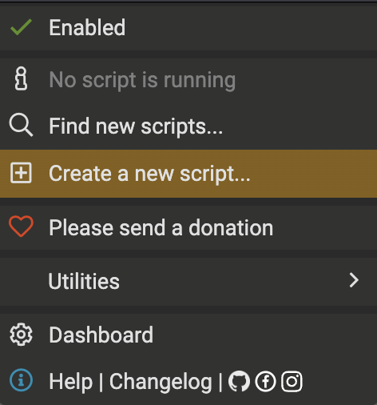
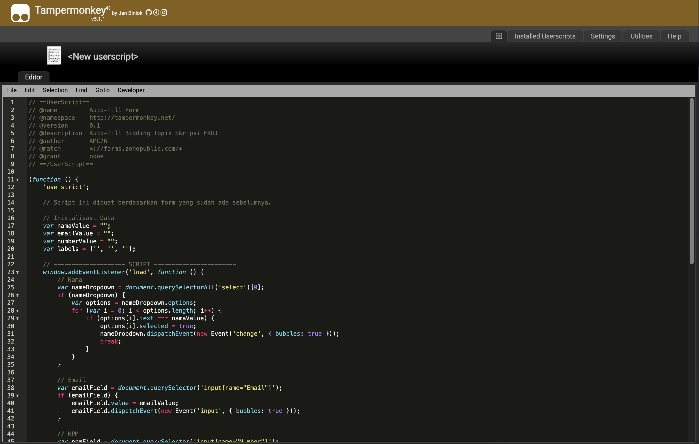
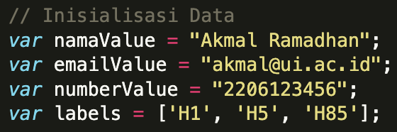

# Auto-fill Form Bidding Topik Skripsi

*Script* untuk pengisian automatis *form bidding* topik skripsi FKUI.

## Cara Penggunaan
1. Siapkan [Tampermonkey](https://www.tampermonkey.net/) pada peramban yang Anda gunakan.

2. Tambahkan *script* baru pada Tampermonkey.

3. Salin [`script.js`](script.js).

4. Isi data Anda.

**Catatan:**
- `namaValue`: Nama
- `emailValue`: Email
- `numberValue`: NPM
- `labels`: Kode unik topik skripsi

5. Simpan perubahan dengan `ctrl + S`.

6. Buka *form* Anda dan *form* sudah otomatis terisi.